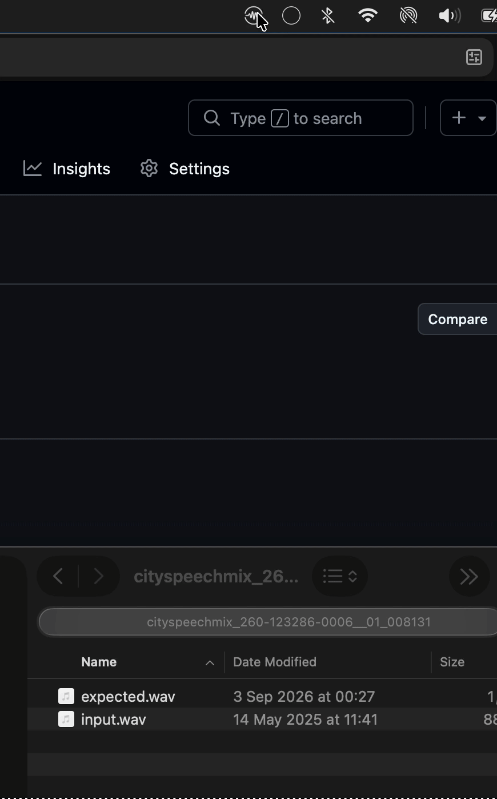
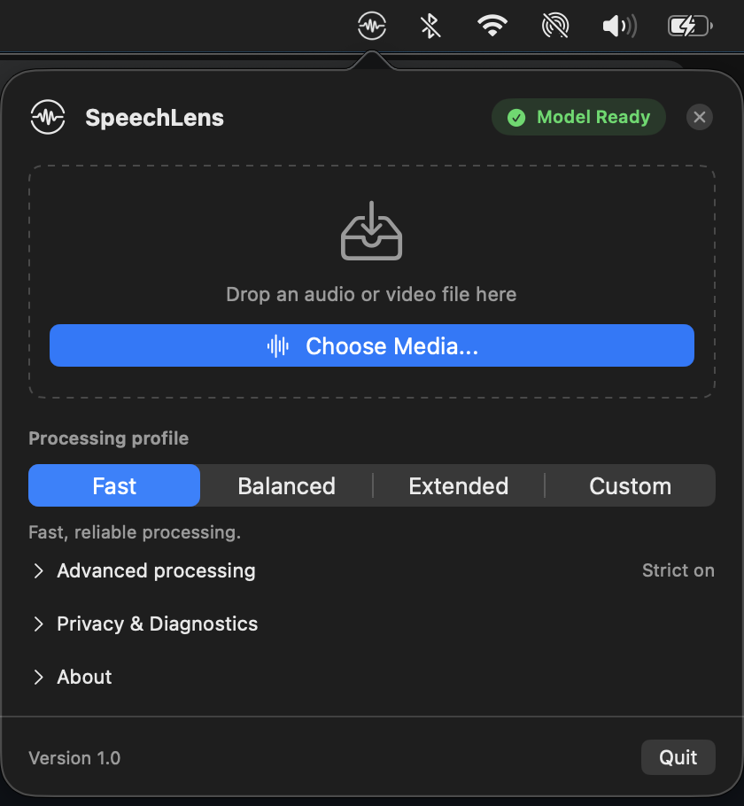
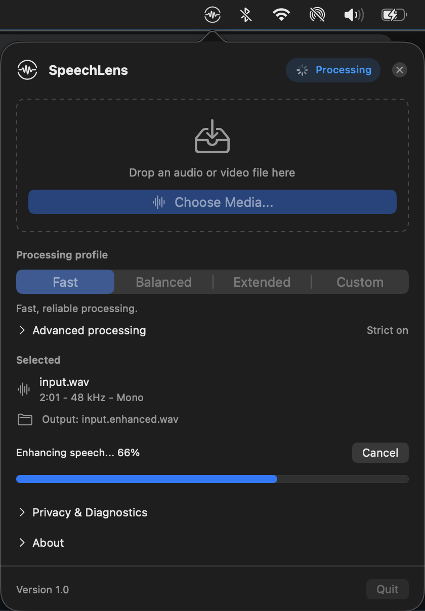
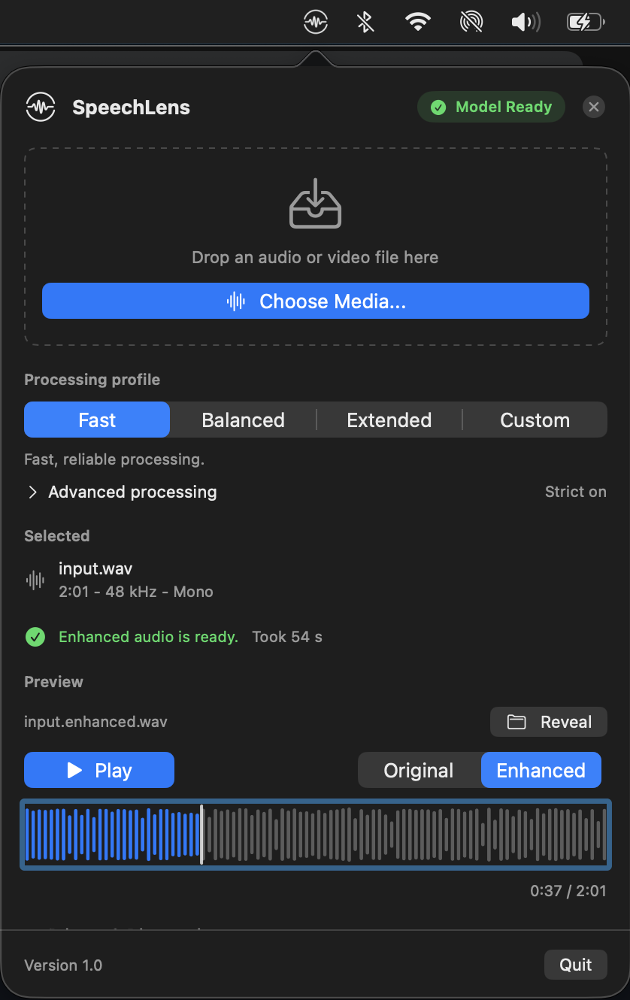

# SpeechLens

[](https://github.com/faraday/SpeechLens/actions/workflows/ci.yml)
[](https://github.com/faraday/SpeechLens/releases/latest)
[](https://github.com/faraday/SpeechLens/releases/latest)
[](docs/architecture.md)
[](Package.swift)
[](LICENSE)

<table>
  <tr>
    <td valign="top" width="58%">
      <h3>Enhance speech locally on your Mac, faster than real time.</h3>
      <p>
        SpeechLens is a native macOS app and CLI that runs the fixed 30-block RE-USE
        SE-Mamba model through Swift, MLX, and specialized Metal kernels on Apple
        Silicon. On an M1 Max, measured streaming enhancement processes audio at
        2.3×–6.6× real-time speed while preserving the input sample rate and frame
        count. Audio never leaves the Mac.
      </p>
      <ul>
        <li>⚡ <b>2.3×–6.6× real-time enhancement</b> on Apple Silicon</li>
        <li>🔒 <b>100% on-device</b> — audio never leaves the Mac</li>
        <li>🎯 <b>Exact native-rate output</b> — zero resampling or quality loss</li>
        <li>🪶 <b>4.4 GB bounded physical footprint</b> (~142 MB host RSS) — no Python or PyTorch runtime</li>
      </ul>
      <p>
        <a href="https://github.com/faraday/SpeechLens/releases/latest"><b>Download the macOS app</b></a>
        · <a href="#hear-the-result">Listen to examples</a>
        · <a href="#command-line">Use the CLI</a>
        · <a href="docs/README.md">Documentation</a>
      </p>
      <p><sub>Release-mode M1 Max measurements. Enhancement timing excludes model loading and file I/O; results vary by Mac and media.</sub></p>
    </td>
    <td align="center" valign="top" width="42%">
      
    </td>
  </tr>
</table>

> [!IMPORTANT]
> SpeechLens source code is Apache-2.0, but the default converted RE-USE model
> weights are separately licensed for
> **non-commercial research and educational use only** under the NVIDIA One-Way
> Noncommercial License (NSCLv1). Review the
> [model terms](docs/model-artifacts.md#licensing) before downloading or using them.

## What it does

- Processes audio on-device through MLX on Metal; audio is never uploaded.
- Preserves the input sample rate and frame count. There is no resampling.
- Enhances every physical channel while retaining channel order and layout.
- Accepts common audio and video containers and preserves non-selected media
  streams where the destination supports them.
- Provides original/enhanced waveform playback in the app and a scriptable CLI.

Optional, independently consented diagnostics go to Sentry in the EU. They
exclude audio, filenames, paths, URLs, transcripts, arbitrary logs, and raw
handled errors. See [Privacy and telemetry](docs/telemetry.md).

## Hear the result

These browser-friendly MP3 previews use identical encoding settings on the
before and after versions. They are compressed listening copies; enhancement
ran at each source's native rate with the pinned model.

| Recording | Before | After | Native rate |
| --- | --- | --- | ---: |
| CitySpeechMix urban noise | [Listen to noisy speech](docs/assets/demo/cityspeechmix-before.mp3) | [Listen to enhanced speech](docs/assets/demo/cityspeechmix-after.mp3) | 44.1 kHz |
| Edinburgh noisy speech | [Listen to noisy speech](docs/assets/demo/edinburgh-before.mp3) | [Listen to enhanced speech](docs/assets/demo/edinburgh-after.mp3) | 48 kHz |

The samples are adapted from CC BY 4.0 datasets. Their exact provenance,
generation recipe, checksums, and lossless sources are recorded in the
[demo manifest](docs/assets/demo/README.md).

## Measured performance

Release measurements recorded on 2 August 2026 on a MacBook Pro with an M1 Max
(64 GB), macOS 26.5, Xcode 26.6, Swift 6.3.3, MLX Swift 0.31.6, and the pinned
model:

| Input | Duration | Enhancement time | RTF | Speed |
| --- | ---: | ---: | ---: | ---: |
| 16 kHz speech | 7.92 s | 1.192 s | 0.151 | 6.6× real-time |
| 44.1 kHz speech | 10.00 s | 3.571 s | 0.357 | 2.8× real-time |
| 48 kHz speech | 2.34 s | 1.003 s | 0.428 | 2.3× real-time |

Real-time factor is enhancement wall time divided by input duration, so lower
is better; the measured fixtures span 15.1%–42.8% RTF. Processing speed is its
reciprocal: input duration divided by enhancement wall time. These measurements
cover streaming enhancement, not model loading or file I/O. See the
[complete methodology and memory gate](docs/performance.md).

## Install the Mac app

SpeechLens requires an Apple Silicon Mac running macOS 14 or newer.

1. Open the [latest GitHub Release](https://github.com/faraday/SpeechLens/releases/latest).
2. Download `SpeechLens-<version>.dmg` and drag SpeechLens to Applications.
3. Launch SpeechLens, review the model terms, and choose **Agree & Download Model**.
4. Drop an audio or video file onto the menu-bar window and choose **Enhance Speech**.
5. Compare the original and enhanced previews, then reveal the new file in Finder.

| 1. Drop media | 2. Enhance on-device | 3. Compare & reveal |
| :---: | :---: | :---: |
|  |  |  |
| Drag any audio/video file or click **Choose Media** | 2.3×–6.6× real-time MLX streaming on Metal | Compare original vs enhanced waveforms |

The app downloads and verifies the pinned model automatically. No Xcode, Python,
manual weight path, or cloud audio service is required.
The release also provides `checksums.txt` for verifying the DMG and CLI zip.

## Validated benchmarks

SpeechLens was evaluated across independent measurement campaigns on the 73-fixture
URGENT-2025 speech enhancement suite against concurrent Apple Silicon runtimes and
cloud server GPUs:

- **2.19× faster than ORT-MLX on Apple Silicon:** Delivers a duration-weighted RTF of
  **0.334** vs. 0.730 for ONNX Runtime MLX on an M1 Max (3.0× real-time), representing a
  **14.06× end-to-end speedup** over unoptimized PyTorch/MPS.
- **1.7×–3.1× lower memory footprint:** Requires **4.41 GB** median macOS physical
  footprint (`phys_footprint`) under its 2048 MiB cache cap, compared to 7.89 GB (capped)
  and 13.04 GB (uncapped default) for ORT-MLX, with zero footprint reversals across all
  73 audio fixtures.
- **Near-NVIDIA L4 throughput at full quality:** Achieves **0.291 RTF** on long recordings
  compared to 0.268 RTF on a discrete 24 GB NVIDIA L4 server card (within 8.3%), while
  matching or exceeding reference objective quality (PESQ 1.89, SDR 5.41 dB).

| System & Engine | Platform & Architecture | Real-Time Factor (RTF) | Median Physical Footprint | Clean PESQ (↑) | Clean SDR (↑) |
| --- | --- | ---: | ---: | ---: | ---: |
| **SpeechLens** (Fast-bitcast)* | Apple Silicon (M1 Max, UMA) | **0.334** (3.0× RT) | **4.41 GB** | **1.89** | **5.41 dB** |
| **ORT-MLX** (Justin Chu, 2026) | Apple Silicon (M1 Max, UMA) | 0.730 (1.4× RT) | 7.89 GB – 13.04 GB | 1.88 | 5.40 dB |
| **NVIDIA RE-USE** (Reference) | Cloud Server (L4 24 GB PCIe) | 0.268 (3.7× RT) | *N/A (19.4 GB VRAM)* | 1.86 | 4.92 dB |

*\* The benchmarked `fast-bitcast-scalar` kernel is selected in the app and CLI via opt-in **Strict Mode** (`--strict`).*

For full multi-layer memory breakdowns (active tensors vs. allocator cache vs. RSS),
73-fixture distributions, phase-fidelity ablations, and negative optimization results,
see [Performance](docs/performance.md) and [Audio Quality](docs/audio-quality.md).

## Why it is fast

- The fixed 30-block RE-USE SE-Mamba architecture runs natively in Swift and MLX.
- Specialized Metal kernels implement Mamba's causal depthwise convolution and
  mandatory fixed-16 selective scan.
- Apple unified memory and a Metal-only inference path avoid CPU/GPU round trips.

The native path represents a measured 14.06× speedup over PyTorch/MPS on the
same hardware, achieved primarily by moving custom kernels inside the MLX lazy
graph and eliminating host-copy bridges. An opt-in Strict Mode selects a
numerically tighter selective-scan variant that reduces phase error from
0.0106 to 0.0011 radians.

See [Architecture](docs/architecture.md) for the data flow,
[Kernel Optimization](docs/kernel-optimization.md) for the profiling evidence
and negative optimization results, and
[Performance](docs/performance.md#execution-path-progression) for the full
measured progression.

## Command line

Download `speechlens-cli-<version>.zip` from the
[latest release](https://github.com/faraday/SpeechLens/releases/latest), keep
the executable beside its packaged `mlx.metallib`, `ffmpeg`, and `ffprobe`, and
provide converted MLX weights:

```bash
speechlens-cli \
  --weights /absolute/path/to/model_mlx.safetensors \
  --input /absolute/path/to/input.wav \
  --output /absolute/path/to/output.wav \
  --chunk-seconds 5.0
```

Pass `--strict` to use Strict Mode, which selects the fast-bitcast-scalar
selective-scan kernel with stable activation functions, explicit Float32
operation ordering, and bounded bitcast exponent scaling. Strict Mode is opt-in
and does not change the media sample rate or frame count.

If `--weights` is omitted, the CLI checks `SPEECHLENS_WEIGHTS`, the app model
cache, and `./model_mlx.safetensors`, in that order. See
[Model Artifacts](docs/model-artifacts.md) for the pinned weights, checksum,
conversion workflow, and license boundary.

## Why SpeechLens?

| Capability | SpeechLens | Generic cloud enhancer | Typical Python research pipeline |
| --- | --- | --- | --- |
| Audio location | Stays on the Mac | Uploaded to a service | Depends on setup |
| Native Mac interface | Menu-bar app | Usually web-based | Usually none |
| Runtime stack | Native Swift + MLX/Metal with specialized SE-Mamba kernels; no Python runtime | Service-dependent | Python environment |
| Performance evidence | 2.3×–6.6× release benchmark; 3.44× in the long-input research campaign | Service-dependent | Hardware and setup-dependent |
| Sample-rate behavior | Exact input rate retained | Service-dependent | Pipeline-dependent |
| Media handling | Audio and video containers; non-selected streams retained | Service-dependent | Usually audio-focused |
| Automation | Packaged CLI | Usually an API | Scripts and notebooks |

This comparison describes deployment and media behavior, not subjective audio
quality. Use the listening examples and your own permitted material to evaluate
whether the model fits your use case.

## Supported media

SpeechLens accepts WAV, AIFF/AIFC, CAF, FLAC, MP3, M4A, MP4, MOV, and AVI. It
preserves the selected audio stream's sample rate and channel layout, chooses a
compatible native-rate output when necessary, and packet-copies non-selected
video, subtitle, and supported audio streams. See the exact
[container and codec policy](docs/media-formats.md).

## Build from source

Building requires an Apple Silicon development Mac running macOS 15.6 or newer
with Xcode 26 and Swift 6.3 or newer. Build unsigned local app and CLI packages:

```bash
Tools/package-local.sh --configuration release
```

Outputs are written under `dist/local/`. Model weights remain a separate
artifact and are not bundled by default. Contributor setup and required test
commands are in [CONTRIBUTING.md](CONTRIBUTING.md).

## Runtime guarantees

```text
output.sampleRate == input.sampleRate
output.frameCount == input.frameCount
```

Inference runs exclusively through MLX on Metal with Apple unified memory. The
runtime does not use PyTorch, CoreML, the Apple Neural Engine, or sample-rate
conversion. No Python runtime is required; weight conversion happens offline,
before the app or CLI loads a model. `MambaEnhancer` exposes mono streaming
sessions; Processing advances one session per physical channel. Internal model
operations remain batch-generic and B=2 parity-tested.

See [Architecture](docs/architecture.md) for the data flow and module boundaries,
and [Inference Runtime](docs/inference.md) for streaming session details.

## Project resources

| Need | Resource |
| --- | --- |
| Public documentation | [Documentation index](docs/README.md) |
| Audio listening demos & manifest | [Demo Manifest](docs/assets/demo/README.md) |
| Runtime architecture and module boundaries | [Architecture](docs/architecture.md) |
| Streaming inference and STFT framing | [Inference Runtime](docs/inference.md) |
| Model checksums and licensing | [Model Artifacts](docs/model-artifacts.md) |
| Supported formats and codecs | [Media Formats](docs/media-formats.md) |
| Media boundary and single FFmpeg engine | [Media Boundary](docs/media-boundary.md) · [FFmpeg Engine](docs/ffmpeg-backend.md) |
| Serial multichannel processing | [Multichannel Processing](docs/multichannel-processing.md) |
| Metal kernel design and optimization | [Kernel Optimization](docs/kernel-optimization.md) |
| Performance gates and measurements | [Performance](docs/performance.md) |
| Fixture inventory and redistribution | [Fixtures](docs/fixtures.md) |
| Quality invariants and regression criteria | [Audio Quality](docs/audio-quality.md) |
| Privacy behavior and diagnostics | [Telemetry](docs/telemetry.md) · [Sentry Operations](docs/sentry-operations.md) |
| Testing and quality gates | [Testing](docs/testing.md) |
| Release packaging and validation | [Release Packaging](docs/release-packaging.md) · [Publication Checklist](docs/publication-checklist.md) |
| Contributing | [Contributor guide](CONTRIBUTING.md) |
| Asset and binary licenses | [Asset Licenses](ASSET-LICENSES.md) |
| Private security reports | [Security policy](SECURITY.md) |

## License

Copyright 2026 Çağatay Çallı

Except where otherwise noted, SpeechLens-authored source code, documentation,
and assets are licensed under Apache License 2.0. See [LICENSE](LICENSE) and
[Asset Licenses](ASSET-LICENSES.md).

Model weights, third-party datasets, and real audio fixtures are not relicensed
by this project. Their separate licenses, notices, attribution requirements,
and usage conditions continue to apply.
