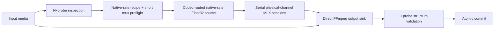

# Architecture

SpeechLens is a native macOS app and CLI. Runtime enhancement is exclusively MLX
on Metal. FFmpeg/FFprobe owns the media boundary; Apple AVFoundation owns only
AAC-to-PCM decoding for M4A, MP4, and MOV.

The GUI is an Xcode-owned SwiftUI menu-bar app. `SpeechLens.xcodeproj` owns
`Sources/App`, its resources, and `SpeechLensAppTests`; the local Swift package
owns the runtime libraries, CLI, WeightPort, and non-app tests. The app links
the package's Diagnostics, Inference, AudioIO, MediaIO, and Processing products. Direct
Developer ID distribution uses Hardened Runtime without App Sandbox, so the
existing Processing-owned sibling transaction remains authoritative.

A thin AppKit coordinator owns `NSStatusItem` and an application-defined
`NSPopover`; unlike `MenuBarExtra(.window)`, this popover remains available
while Finder has focus so a user can drag media into its drop target. SwiftUI
continues to own the hosted menu content.



## Boundaries

| Module | Owns | Must not own |
|---|---|---|
| App | workflow, track selection, processing profiles, model cache, playback, App-only crash telemetry, output presentation | codec or stream-map policy |
| Diagnostics | sanitized report schema, persistence, recovery, stable failure taxonomy, local hardware facts | UI presentation, network reporting, processing policy, or sensitive content |
| Processing | frozen jobs, source identity, serial channel scheduling, preview capture, transaction and commit | format profiles, resampling |
| MediaIO | FFprobe model, Apple AAC PCM decoding, recipe planning, preflight, bounded FFmpeg media processes, structural validation | inference, metadata identity rules |
| Inference | MLX model, streaming sessions, sample-rate-scaled STFT | file or container I/O |
| AudioIO | planar blocks and simple native audio utilities | production container routing |

## Invariants

- `output.sampleRate == input.sampleRate`; no sample-rate conversion.
- One mono inference session is advanced per physical channel, serially.
- Timestamp gaps are rendered as digital silence without soft compensation.
- The selected audio stream is replaced at its ordered stream position.
- Other audio, video, subtitle, and attached-picture streams are packet-copied.
- Generic data/timecode streams are omitted and reported.
- Preflight occurs before model loading.
- AAC inside AVI is rejected explicitly; other supported AVI audio is unchanged.
- Cancellation and failure remove only transaction-owned files.
- Existing destinations are changed only by the final atomic commit.
- GUI output is a collision-free sibling of the source; no output-folder
  preference or Save As transaction exists.
- Missing pinned weights download automatically into
  `~/Library/Application Support/SpeechLens/Models`.

## Multi-Rate STFT Scaling

The model achieves sample-rate invariant behavior by scaling STFT and iSTFT
parameters from an 8 kHz base configuration (FFT size 320, hop length 40).
At native rate `s`, each parameter `p` is scaled as:

```text
p_s = makeEven(floor(p × s / 8000))
```

Representative configurations:

| Native rate | FFT size | Hop length | Spectral shape (5 s input) |
| ---: | ---: | ---: | --- |
| 16 kHz | 640 | 80 | [1, 321, 1001] |
| 44.1 kHz | 1764 | 220 | [1, 883, 1003] |
| 48 kHz | 1920 | 240 | [1, 961, 1001] |

The hop correction from 222 to 220 at 44.1 kHz (integer floor alignment with
the NVIDIA reference) was a significant upstream parity fix.

## Strict Mode

Strict Mode is an opt-in production configuration (`--strict` in the CLI,
advanced settings in the app) that selects the fast-bitcast-scalar
selective-scan kernel variant. It uses stable softplus, direct-division SiLU,
explicit Float32 operation ordering, ordinary `exp` for the state-decay
parameter, and bounded IEEE exponent-field scaling. Strict Mode reduces
maximum phase error from 0.0106 to 0.0011 radians on the 44.1 kHz diagnostic.
See [Kernel Optimization](kernel-optimization.md) for the polynomial
specification and [Audio Quality](audio-quality.md#phase-fidelity) for the
full phase analysis.

Container byte identity, source audio codec/bitrate, track IDs, atom layout,
private associations, and exact metadata reproduction are intentionally outside
the product contract.
