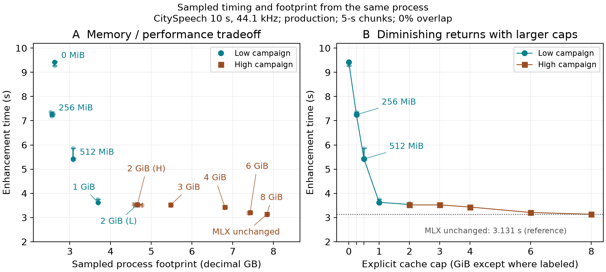

# Performance

Performance requirements are fitness gates, not aspirational targets.

## Throughput Gate

Enhancement should complete in no more than the input duration for every
discovered real fixture.

```text
enhancement_wall_time <= input_duration
```

Measurement excludes model construction and file read. The gate focuses on
streaming enhancement via `MambaEnhancer.makeSession(...)` followed by session
`append`/`finish` (tests time `collectEnhancedSamples(...)`).

## MLX Swift 0.31.3 → 0.31.6 Evolution

Recorded 2026-08-02 on a MacBook Pro with Apple M1 Max (64 GB), macOS 26.5,
Xcode 26.6, and Swift 6.3.3. Both runs used Release optimization, the pinned
converted model, and the three committed real fixtures; only the processing
chunk setting varied (30 seconds or 5 seconds).

The following release measurements were taken on the same Apple Silicon host,
with the same converted model and real fixtures. The percentage is
`enhancement wall time / input duration`; lower is better. A value below 100%
passes the 1:1 realtime gate.

| MLX Swift and execution path | 16 kHz / 30 s | 44.1 kHz / 30 s | 48 kHz / 30 s | 16 kHz / 5 s | 44.1 kHz / 5 s | 48 kHz / 5 s |
| --- | ---: | ---: | ---: | ---: | ---: | ---: |
| 0.31.3, implicit default | 1.169 s (14.8%) | 3.657 s (36.6%) | 0.983 s (42.0%) | 1.201 s (15.2%) | 3.647 s (36.5%) | 1.036 s (44.3%) |
| 0.31.6, implicit default (before fix) | 1.144 s (14.4%) | 12.901 s (129.0%) | 3.802 s (162.4%) | 4.096 s (51.7%) | 13.086 s (130.9%) | 4.651 s (198.7%) |
| 0.31.6, explicit GPU scope (current) | 1.151 s (14.5%) | 3.695 s (37.0%) | 0.961 s (41.1%) | 1.192 s (15.1%) | 3.571 s (35.7%) | 1.003 s (42.8%) |

The 0.31.6 slowdown was an integration regression, not a regression in the
MLX compute core. The underlying MLX C++ and MLX-C revisions were unchanged;
the Swift wrapper changed default-device resolution. SpeechLens had relied on
the older wrapper's implicit GPU default. The Inference module now scopes model
construction, weight loading, and window evaluation with
`Device.withDefaultDevice(.gpu)`, restoring 0.31.6 to the 0.31.3 performance
range while preserving MLX Swift 0.31.6.

The corrected 0.31.6 run also passed the peak-RSS gate: the largest observed
resident set was 141.6 MB against the 150 MB limit. Model-backed correctness,
sample-rate/frame-count identity, and B=2 parity remained green after the
device-scoping change.

## Research Benchmarks

Separate measurement campaigns evaluated SpeechLens against concurrent
implementations on real-world audio corpora. These campaigns used the
URGENT-2025 evaluation protocol with 5-second chunks, zero overlap, 1 warmup,
and 3 timed trials per fixture.

### Execution Path Progression

The native MLX path was developed through a measured progression from slower
execution strategies. All measurements used a common 5-second input at
44.1 kHz on the M1 Max (5 warmups, 20 timed trials, excluding model loading
and file I/O):

| Execution path | Median time (s) | p90 (s) | Relative to native |
| --- | ---: | ---: | ---: |
| PyTorch / MPS | 31.190 | 31.479 | 14.1× slower |
| CPU / Accelerate | 35.106 | 35.545 | 15.8× slower |
| PyTorch + custom Metal scan | 4.831 | 4.900 | 2.18× slower |
| PyTorch + Metal orchestration | 5.886 | 5.893 | 2.65× slower |
| MLX + host-copy scan | 16.422 | 18.283 | 7.40× slower |
| MLXFast scan | 6.888 | 6.976 | 3.10× slower |
| **MLXFast scan + Conv1d** | **2.219** | **2.259** | **1.00× (production)** |
| MLXFast scan + Conv1d (2 GiB cap) | 2.793 | 2.951 | 1.26× |

The progression demonstrates that framework integration choices—not only kernel
speed—dominate end-to-end inference time. Moving custom kernels inside the MLX
lazy graph eliminated host-copy bridges and produced a 14.06× speedup over
PyTorch/MPS.

#### CPU / Accelerate Optimization Impact

The CPU/Accelerate path highlights how micro-architectural memory layout and tiling choices govern performance on Apple Silicon CPU cores:
- **Optimized build** (`-DSEMAMBA_SCAN_CHANNELS=8 -DSEMAMBA_SCAN_TILE=8 -DSEMAMBA_ROW_IM2COL=1`): **35.106 s** median (p90 35.545 s, RTF 7.021).
- **Baseline flags** (omitting tiling and row-packed layout macros): **42.173 s** median (p90 43.260 s, RTF 8.435).

Omitting the 8-channel / 8-frame scan tiling and row-major im2col packing caused a 1.20× slowdown (16.8% latency regression). Loop tiling preserves intermediate state in L1/L2 cache and NEON registers during the selective scan recurrent step, while row-major im2col eliminates matrix-transposition overhead during causal convolutions. When compiled with these optimizations, CPU execution on real speech closely matches the historical synthetic deterministic noise baseline (36.056 s).

### Production Native-Rate Sweep

Historical production measurements on 5-second inputs (5 warmups, 20 trials):

| Rate | Median time (s) | RTF | p90 (s) |
| --- | ---: | ---: | ---: |
| 16 kHz | 0.624 | 0.125 | 0.631 |
| 44.1 kHz | 1.757 | 0.351 | 1.778 |
| 48 kHz | 1.871 | 0.374 | 1.888 |

### ORT-MLX Comparison

A head-to-head campaign evaluated SpeechLens against ORT-MLX (Justin Chu's
ONNX Runtime MLX implementation, merged August 2026) on 73 audio fixtures.
The benchmarked SpeechLens configuration uses the `fast-bitcast-scalar` selective-scan
kernel, which is exposed in production as opt-in **Strict Mode** (`--strict` in the CLI).

Duration-weighted RTF (sum of per-fixture median seconds divided by sum of
fixture durations):

| Corpus | Fast-bitcast RTF | ORT-MLX RTF | Speed ratio |
| --- | ---: | ---: | ---: |
| URGENT combined (n=70) | 0.334 | 0.730 | **2.19×** |
| Long recordings (n=3, ~2 min each) | 0.309 | 0.678 | **2.19×** |

All 73 fixture medians ran faster than real time in both engines.

Sampled process physical footprint across 219 fresh processes (73 fixtures × 3 configurations, 20 ms sampling during inference, decimal GB):

| Workload ($n$) | Deployment / cache policy | Median footprint | Max sample |
| --- | --- | ---: | ---: |
| URGENT combined (70) | **Fast-bitcast (2048 MiB cap)** | **4.410 GB** | **5.034 GB** |
| URGENT combined (70) | ORT-MLX (pinned default) | 13.039 GB | 21.542 GB |
| URGENT combined (70) | ORT-MLX (2048 MiB cap) | 7.891 GB | 9.352 GB |
| Long recordings (3) | **Fast-bitcast (2048 MiB cap)** | **4.576 GB** | **4.827 GB** |
| Long recordings (3) | ORT-MLX (pinned default) | 13.186 GB | 15.487 GB |
| Long recordings (3) | ORT-MLX (2048 MiB cap) | 8.291 GB | 8.812 GB |

SpeechLens had a lower physical footprint on 100% of all 73 fixtures under both
ORT-MLX policies. On URGENT, the median paired ratio was **3.073×** against
default ORT (median delta $+8.854\text{ GB}$, 95% bootstrap CI $[7.572, 10.663]$)
and **1.720×** against capped ORT (median delta $+3.295\text{ GB}$, 95% CI
$[2.889, 3.540]$).

These are reproducible single-machine engineering measurements on the same
M1 Max host, not a controlled framework comparison.

### CPU / Accelerate Baseline

A historical CPU/Accelerate implementation provided reference timing on
5-second deterministic inputs (5 warmups, 20 trials):

| Rate | Median time (s) | RTF |
| --- | ---: | ---: |
| 8 kHz | 6.391 | 1.278 |
| 16 kHz | 12.752 | 2.550 |
| 44.1 kHz | 36.056 | 7.211 |
| 48 kHz | 39.540 | 7.908 |

CPU timing was validated at all four rates, but strict phase acceptance remains
incomplete at 44.1 kHz (max 0.00202 rad vs 0.0013 rad tolerance) and 48 kHz
(max 0.00255 rad).

## Memory Gate

Peak resident set size for the release CLI should stay below:

```text
150_000_000 bytes
```

The RSS test runs the release `speechlens-cli` process through macOS
`/usr/bin/time -l`. Measuring a separate process avoids SwiftPM and XCTest
memory overhead.

## Running Performance Tests

Build local release artifacts first so the RSS test can find the CLI:

```bash
Tools/package-local.sh --configuration release
```

Prepare the release test metallib, then run performance tests with release
optimization:

```bash
export SPEECHLENS_TEST_WEIGHTS=/absolute/path/to/model_mlx.safetensors
Tools/prepare-test-metallib.sh --configuration release
swift test -c release --skip-build --disable-swift-testing --filter PerformanceTests
```

## Hardware Assumptions

Performance numbers are Apple Silicon dependent. Public performance claims
should include:

- Mac model or chip.
- macOS version.
- Xcode and Swift versions.
- input sample rate and duration.
- chunk settings.
- whether the run was debug or release.

Do not compare numbers across machines without recording this context.

## Profiling Guidance

Use profiling to answer one question at a time. Keep raw experiment logs out of
stable docs unless they have been converted into a short, dated decision record.

Useful investigation routes:

- Instruments or Metal System Trace for GPU dispatch timing.
- paired alternating runs with cooldown for small performance deltas.
- audio output diffing after kernel or graph changes.

### Buffer Cache Policy

`SPEECHLENS_CACHE_LIMIT_MB` controls MLX's buffer allocator cache cap. It
defaults to **2048 MiB**; `0` disables the cache entirely and a negative value
leaves MLX's default limit unchanged.

The 2048 MiB default was selected based on a systematic 11-point cache sweep
on a 10-second 44.1 kHz fixture (66 fresh processes, 198 trials).



Key observations:

- **Elbow at 1 GiB:** Below 1 GiB, execution time rises steeply (9.4 s at
  0 MiB → 3.6 s at 1 GiB). Above 1 GiB, gains flatten (Panel B).
- **2 GiB vs uncapped MLX:** The 2 GiB cap uses **40.6% less physical
  footprint** (4.66 GB vs 7.84 GB) for a **12.5% execution time penalty**
  (3.52 s vs 3.13 s) (Panel A).
- **Footprint scaling:** Physical footprint tracks cache cap linearly above
  the elbow.

### Memory Accounting Layers

Memory accounting differs fundamentally between Apple Silicon unified memory
architecture (UMA) and discrete-GPU platforms (PCIe). On macOS, the operating
system tracks physical memory via `task_vm_info.phys_footprint`, measuring
actual dirty physical pages across both CPU and unified Metal/MLX GPU buffers.
On Linux systems with discrete GPUs (such as NVIDIA L4), host CPU system RAM
(tracked via RSS) and accelerator VRAM (tracked via CUDA allocated and reserved
counters) are physically separate domains across a PCIe bus; adding host RSS to
device VRAM is an architectural category error.

Apple Silicon unified memory reports multiple distinct counters that must not
be summed or conflated:

- **OS physical footprint**: sampled process footprint (`task_vm_info.phys_footprint`)
  including unified memory pages mapped by the GPU allocator.
- **MLX peak active allocation**: the allocator's internal high-water mark for
  live tensors, excluding cached but freed buffers.
- **MLX after-trial cache**: retained allocator cache after inference completes.
- **Process RSS (`ru_maxrss`)**: lifetime high-water mark of the Swift process
  itself, typically much smaller than the GPU allocation.

#### Cross-Engine Memory Comparison

Peak and median memory counters across SpeechLens (M1 Max, 64 GB UMA),
ORT-MLX (M1 Max, 64 GB UMA), and the pinned NVIDIA RE-USE reference (L4 24 GB
PCIe, Linux host) on the 73-fixture benchmark suite (5-second chunks, zero
overlap, fresh processes with 20 ms sampling; decimal units):

| System & Engine | Hardware & Architecture | Cache policy | Live active tensors (GPU/UMA) | Retained allocator cache | macOS physical footprint (Median / Max) | Host process RSS (`ru_maxrss`) |
| --- | --- | --- | ---: | ---: | ---: | ---: |
| **SpeechLens** (Fast-bitcast) | M1 Max (Apple Silicon UMA) | 2048 MiB cap | 3.38 GB (5 s) / 5.615 GB (10 s) | 2.13 GB | **4.410 GB / 5.034 GB** | 148 MB median (351 MB matrix max) |
| **ORT-MLX** (Pinned default) | M1 Max (Apple Silicon UMA) | Uncapped default | — (internal pool) | Dynamic | 13.039 GB / 21.542 GB | 13.28 GB median |
| **ORT-MLX** (Matched cap) | M1 Max (Apple Silicon UMA) | 2048 MiB cap | — (internal pool) | 2.05 GB | 7.891 GB / 9.352 GB | 8.21 GB median |
| **NVIDIA RE-USE** (Reference) | NVIDIA L4 (Discrete PCIe) | PyTorch caching | 2.82–2.88 GB (5 s) / 5.624 GB (10 s) | 19.36 GB reserved | *N/A (Discrete PCIe)* | 1.50–1.71 GB host |

Key architectural observations:

1. **Mathematical Live Tensor Parity (5.615 GB vs. 5.624 GB):**
   In the 6-configuration matrix evaluating 10-second chunks at 48 kHz across 30 SE-Mamba blocks ($[1, 961, 1001]$ spectral input), SpeechLens peak MLX active allocation was **5,615.495 MB** ($5.615\text{ GB}$) and NVIDIA L4 peak CUDA allocated was **5,623.994 MB** ($5.624\text{ GB}$). The tiny $8.5\text{ MB}$ delta ($0.15\%$) confirms that both runtimes evaluate identical mathematical tensor graph structures ($D=128$, $d_{state}=16$, $d_{conv}=4$, $expand=2$); minor divergence arises from framework-specific buffer alignment (MLX 16/32-byte alignment vs. PyTorch 512-byte CUDA pool quantization). Both round to $5.62\text{ GB}$ at two decimal places.

2. **Cache Retention and Memory Pressure:**
   On discrete server GPUs, PyTorch retains a **19.36 GB** ($19,358.8\text{ MB}$) reserved CUDA pool across iterations to eliminate buffer reallocation overhead, relying on unshared VRAM. On Apple Silicon unified memory, greedy caching directly consumes memory shared with other applications and the OS. SpeechLens bounds allocator retention via `SPEECHLENS_CACHE_LIMIT_MB` (default 2048 MiB), holding post-trial retained cache to 2.13 GB. Uncapped ORT-MLX reached a median physical footprint of 13.04 GB (max 21.54 GB), whereas SpeechLens kept median footprint to 4.41 GB.

3. **Physical Domain Distinction (Discrete PCIe vs. Unified UMA):**
   NVIDIA L4 has no single "physical footprint" figure because host system RAM (1.50–1.71 GB RSS) and device VRAM (2.88 GB active, 19.36 GB reserved) reside in separate physical memory spaces across PCIe. On Apple Silicon, `task_vm_info.phys_footprint` encompasses the process's entire dirty memory footprint in unified RAM.

4. **Host RSS vs. Release Gate:**
   The **141.6 MB peak RSS** headline reflects the release gate's single short-fixture threshold, verified via `/usr/bin/time -l` on the native CLI. Multi-fixture benchmark harnesses log higher host RSS (148 MB median, 198 MB on short suites, 351 MB matrix peak) due to test harness process lifetimes. L4 host RSS captures the Python process running PyTorch.

The [Kernel Optimization Rationale](kernel-optimization.md) records the measured
bottleneck, rejected MLX graph rewrite, memory analysis, and fallback contract
behind the specialized causal depthwise convolution.
